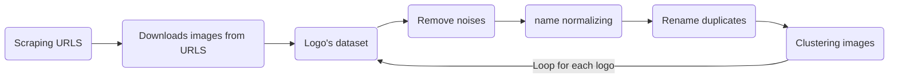

# Image Classifier

## Description

This repository shows how to classify logos from images. It builds an image classifier using a Sequential model and load data using tf.keras.preprocessing.image from ImageDataGenerator.

Image Classification is a Machine Learning module that trains itself from an existing dataset of multiclass images and develops a model for future prediction of similar images not encountered during training. Developed using Convolutional Neural Network (CNN).

This repository contains implementation for multiclass image classification using Keras as well as Tensorflow.

## Install

Make sure you have installed Python3 (3.6 or 3.7) and Tensorflow ( version 2.1.0 )

#### Check install

You have to install python3 (>=3.6).

run these commands to check the version of Python and Tensorflow:

###### Python

```bash
python3 --version
Python3.7.3
```

Or

```bash
python --version
Python3.7.3
```

###### Tensorflow

```bash
python3 -c 'import tensorflow as tf; print(tf.__version__)'
2.1.0
```

## Dataset

The dataset need to be downloaded in 3 steps:

1. Generate Brand Keywords
2. Scrap Image URLs from Google Image Search Engine using `Puppeteer`
3. Download Image from the scrapped URLs

### Brand Keywords

Under `./Scraper/keywords` add a file with for a given brand.

Each line in the brand keywords will be used to search for images.

> The keyword file should not contain empty lines.

### Image Scrapping with Puppeteer

Make sure you have `Nodejs` is installed on your machine.

Under `./Scraper` dir run:

```bash
npm install
```

To run the URL scrapping process under `./Scraper`:

```bash
node google-images.js
```

This script will create a file with all images URLs for each brand keyword file under `./Scraper/urls`.

### Image Download with `wget`

Under the `./Scripts` directory, use the `downloadAndClean.sh` script to start downloading all the images in the urls files under `./Scraper/urls`.

All downloaded images can be found under `./Scraper/download`.

## Cleaning data

This is our Flowchart diagram for data cleaning step :




# Split data
In order to split data into train and validation, you can use `split_folders` as a Command Line Interface (CLI).
If your datasets is balanced (each class has the same number of samples), choose ratio otherwise fixed.

Usage:

```bash
    split_folders <path_folder_with_images> [--output] [--ratio] [--fixed] [--seed] [--oversample]
```

Example:

```bash
    split_folders ./Dataset/train --output ./data --ratio .8 .1 .1
```


# Clustering data

To cluster your images you have to run the script (`groupimg.py`) in the `Scripts` folder using the following command:

`python3 groupimg.py`

-f : folder where your logos are `python3 groupimg.py -f /home/user/Pictures`

-k : number of clusters you want to separate your images into. `python3 groupimg.py -f /home/user/Pictures -k 5`

-m : if you want to move your images instead of just copying.

-s : use size to compare images (Don't use this one).

-r : resize the images

```bash
python3 groupimg.py [-h] -f folders [-k kmeans] [-r resample] [-s] [-m]
```

## How to run train and test files

After you explore the data, you need to run the files in the following order:

- First you have to execute the t.py file which is already on your repo by giving it as argument a noun to your model which is required, the number of epochs (optional), the number of batch_size ( required only if you have a very small size of dataset) :  :

```bash
python3 t.py <MODEL_NAME> -ep [NUMBER_OF_EPOCHS] -b [NUMBER_OF BATCH_SIZE] -p [PATH_TO_DATASET] -d1 [DROPOUT1] -d2 [DROPOUT2] -o [OTIMIZER] -l [LEARNING_RATE] -m [MOMENTUM] -b1 [BETA1] -B2 [BETA2] --nesterov --amsgrad --tflite
```
- nesterov : True by default
- amsgrad  : True by default
- tflite  : False by default

- Then, a `report.csv` file will be generated to show you values of each parameter of your model training.

- secondly you have to execute the p.py file by giving it two arguments, the first argument is the noun of the model and the second one is the path of the test picture (the format you want) as the exemple bellow :

```bash
python3 p.py <MODEL_NAME> <PATH_TO_TARGET_IMAGE> --tflite
```
- tflite  : False by default

- Either, you can test the prediction of a folder of images. You have just to run :

```bash
python3 bp.py <MODEL_NAME> <PATH_TO_Folder> --tflite
```
- tflite  : False by default


>Before runing your ```p.py``` or ```bp.py``` file, make sure that your list of classes ```L``` contains the same brands you have trained on them in the ```t.py``` file 


## Using K-fold cv

Under the `vantage` directory, use the `k-fold.sh` script to start your k-fold process with the command below :

```bash
Scripts/k-fold.sh <DIRECTORY_APTH> <NBR_OF_FOLDS> <NBR_OF_RANDOMS> <TRAINING_SLICE> <EPOCHS> <OPTIMIZER> <LEARNING_RATE> <THE_FIRST_DROPOUT> <THE_SECOND_DROPOUT>
```

## Requirement

This project uses Tensorflow to define deep learning models. Therefore, installing Tensorflow ( >=2.0.0) is a pre-requisite. You can find instructions [here](requirements.txt)

#### How it works

Run the next command:

```bash
pip3 install -r requirements.txt
```

#### Reporting

We use TensorBoard as a tool of reporting so that we can visualize the performance of our models. To show this, make sure you are on the project directory and run :


```bash
tensorboard --logdir='logs/'
```


## Contributing

Please read [this](CONTRIBUTING.md) for details on our code of conduct, and the process for submitting pull requests to us.


## Rest API

Under ./flaskApp_vantage2 folder, you can run your rest api for your prediction file using flask & swagger.

```bash
python3.6 -m flask run
```

## Other

you can add these modifications in case you need them


### Grayscale image

If you want to train your dataset with only grayscale images, you can add the following parameter to your training dataset : 

```bash
preprocessing_function = myFunc
```


```bash
train_image_generator = ImageDataGenerator(rescale=1. / 255,preprocessing_function = myFunc)

```                                          

while myFunc take as parameter (image):

```bash
def myFunc(image):
    image = np.array(image)
    gray = tf.image.rgb_to_grayscale(image)
    return gray
```

### Show images

```bash
# This function will plot images in the form of a grid with 1 row and 5 columns where images are placed in each column.
def plotImages(images_arr):
    fig, axes = plt.subplots(1, 5, figsize=(20,20))
    axes = axes.flatten()
    for img, ax in zip( images_arr, axes):
        ax.imshow(img)
        ax.axis('off')
    plt.tight_layout()
    plt.show()
plotImages(sample_training_images)
```

### Confusion matrix

#### visualize confusion matrix locally

```bash

# Get most likely class
predicted_classes = np.argmax(predictions, axis=1)
true_classes = val_data_gen.classes
class_labels = list(val_data_gen.class_indices.keys())
report = metrics.classification_report(true_classes, predicted_classes, target_names=class_labels)
mat = metrics.confusion_matrix(true_classes, predicted_classes)
def plot_confusion_matrix(cm,
                          target_names,
                          title='Confusion matrix',
                          cmap=None,
                          normalize=True):

    accuracy = np.trace(cm) / float(np.sum(cm))
    misclass = 1 - accuracy

    if cmap is None:
        cmap = plt.get_cmap('Blues')

    plt.figure(figsize=(8, 6))
    plt.imshow(cm, interpolation='nearest', cmap=cmap)
    plt.title(title)
    plt.colorbar()

    if target_names is not None:
        tick_marks = np.arange(len(target_names))
        plt.xticks(tick_marks, target_names, rotation=45)
        plt.yticks(tick_marks, target_names)

    if normalize:
        cm = cm.astype('float') / cm.sum(axis=1)[:, np.newaxis]


    thresh = cm.max() / 1.5 if normalize else cm.max() / 2
    for i, j in itertools.product(range(cm.shape[0]), range(cm.shape[1])):
        if normalize:
            plt.text(j, i, "{:0.4f}".format(cm[i, j]),
                     horizontalalignment="center",
                     color="white" if cm[i, j] > thresh else "black")
        else:
            plt.text(j, i, "{:,}".format(cm[i, j]),
                     horizontalalignment="center",
                     color="white" if cm[i, j] > thresh else "black")


    plt.tight_layout()
    plt.ylabel('True label')
    plt.xlabel('Predicted label\naccuracy={:0.4f}; misclass={:0.4f}'.format(accuracy, misclass))
    plt.savefig('Classification_report/'+ model_nom +'.jpg')

plot_confusion_matrix(mat,
                          class_labels,
                          title='Confusion matrix',
                          cmap=None,
                          normalize=True)

def pandas_classification_report(y_true, y_pred):
    metrics_summary = metrics.precision_recall_fscore_support(
            y_true=y_true,
            y_pred=y_pred)

    avg = list(metrics.precision_recall_fscore_support(
            y_true=y_true,
            y_pred=y_pred,
            average='weighted'))

    metrics_sum_index = ['precision', 'recall', 'f1-score', 'support']
    class_report_df = pd.DataFrame(
        list(metrics_summary),
        index=metrics_sum_index,
        columns=class_labels)

    support = class_report_df.loc['support']
    total = support.sum()
    avg[-1] = total

    class_report_df['avg / total'] = avg

    return class_report_df.T

df_class_report = pandas_classification_report(true_classes, predicted_classes)
df_class_report.to_csv('Classification_report/'+ model_nom +'.csv',  sep=',')

```

#### visualize confusion matrix in Tensorboard tool

```bash
file_writer_cm = tf.summary.create_file_writer('logs/{}/cm'.format(model_nom))
```


```bash
test_steps_per_epoch = np.math.ceil(val_data_gen.samples / val_data_gen.batch_size)
predictions = model.predict_generator(val_data_gen, steps=test_steps_per_epoch)
```


```bash
predicted_classes = np.argmax(predictions, axis=1)
true_classes = val_data_gen.classes
class_labels = list(val_data_gen.class_indices.keys())
report = metrics.classification_report(true_classes, predicted_classes, target_names=class_labels)
mat = metrics.confusion_matrix(true_classes, predicted_classes)
def plot_confusion_matrix(cm, class_names):

  figure = plt.figure(figsize=(8, 8))
  plt.imshow(cm, interpolation='nearest', cmap=plt.cm.Blues)
  plt.title("Confusion matrix")
  plt.colorbar()
  tick_marks = np.arange(len(class_names))
  plt.xticks(tick_marks, class_names, rotation=45)
  plt.yticks(tick_marks, class_names)

  # Normalize the confusion matrix.
  cm = np.around(cm.astype('float') / cm.sum(axis=1)[:, np.newaxis], decimals=2)

  # Use white text if squares are dark; otherwise black.
  threshold = cm.max() / 2.
  for i, j in itertools.product(range(cm.shape[0]), range(cm.shape[1])):
    color = "white" if cm[i, j] > threshold else "black"
    plt.text(j, i, cm[i, j], horizontalalignment="center", color=color)

  plt.tight_layout()
  plt.ylabel('True label')
  plt.xlabel('Predicted label')
  return figure

def plot_to_image(figure):
  """Converts the matplotlib plot specified by 'figure' to a PNG image and
  returns it. The supplied figure is closed and inaccessible after this call."""
  # Save the plot to a PNG in memory.
  buf = io.BytesIO()
  plt.savefig(buf, format='png')
  # Closing the figure prevents it from being displayed directly inside
  # the notebook.
  plt.close(figure)
  buf.seek(0)
  # Convert PNG buffer to TF image
  image = tf.image.decode_png(buf.getvalue(), channels=4)
  # Add the batch dimension
  image = tf.expand_dims(image, 0)
  return image

def log_confusion_matrix(epoch, logs):
  # Use the model to predict the values from the validation dataset.
  test_pred_raw = model.predict_generator(val_data_gen)
  test_pred = np.argmax(test_pred_raw, axis=1)

  # Calculate the confusion matrix.
  cm = metrics.confusion_matrix(true_classes, test_pred)
  # Log the confusion matrix as an image summary.
  figure = plot_confusion_matrix(cm, class_names=class_labels)
  cm_image = plot_to_image(figure)

  # Log the confusion matrix as an image summary.
  with file_writer_cm.as_default():
    tf.summary.image("Confusion Matrix", cm_image, step=epoch)

# Define the per-epoch callback.    
cm_callback = tf.keras.callbacks.LambdaCallback(on_epoch_end=log_confusion_matrix)

```

>Then, you can add the parameter ```cm_callback``` to :

```bash
callbacks=[tensorboard, cm_callback]
```

>You can rise the image resolution by changing the ```target_size``` parameter 


